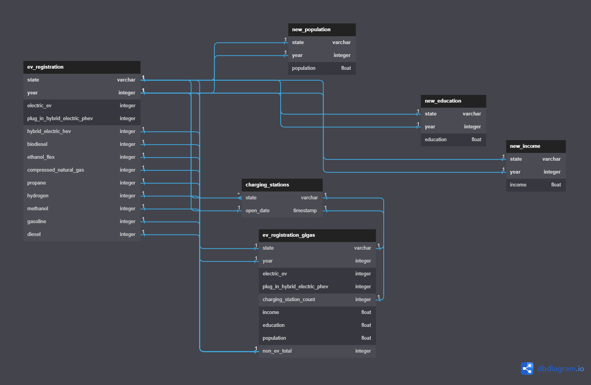

## Modeling Electric Vehicle Registrations & EV Infastructure

### Topic
We have chosen to evaluate the growth of electric vehicles nationwide and determine whether charging station infrastructure is on pace to meet demand. The objective of our project is to build machine learning models that can predict the number of electric vehicle registrations and charging stations by state.

### Reason for Selection
The buildup of greenhouse gases as a result of burning fossil-fuels is a significant contributor to climate change. About 27% of the United States greenhouse gas emissions are from transportation. With mounting pressure to address climate change, federal and state governments have pushed policies to reduce fossil-fuel emissions and incentivize alternative fuel solutions. Individuals have increasingly switched to alternative fuel vehicles including battery electric vehicles (BEVs) and plug-in hybrid electric vehicles (PHEVs). Nationwide, electric vehicle registrations have grown 320% in the last 6 years. Electric vehicle infrastructure, such as charging stations, needs to be prioritized to meet this rising demand and to maximize the benefits of electric vehicles in slowing greenhouse gas emissions and ensuring a cleaner environment.

### Data Sources
#### Vehicle Registrations
Light-duty vehicle registration counts from 2016-2021 by state and fuel-type. Counts are rounded to the nearest 100 vehicles. 
Source: Alternative Fuels Data Center. (2021). Vehicle Registration Counts by State [data set]. https://afdc.energy.gov/vehicle-registration. 

#### Charging Stations
Alternative fuel stations, including electric, nationwide as of July 19, 2021. Information includes address, access, open date, etc. 
Source: Alternative Fuels Data Center. (2021). Alternative Fuel Stations 2021 [data set]. https://catalog.data.gov/dataset/alternative-fueling-station-locations-422f2. 

#### Population
Population estimates by state and region from 2010 to 2022. Estimates are based on the 2010 Census. 
Source: U.S. Census Bureau. Population Division.  (2019). Annual Estimates of the Resident Population for the United States, Regions, States, and Puerto Rico [data set]. https://www.census.gov/data/datasets.html. 

#### Median Household Income
Annual median household income (dollars) by state and nationwide from 2016-2021. 
Source: Federal Reserve Bank of St. Louis (2021). Median Household Income by State, Annual [data set]. https://fred.stlouisfed.org/release/tables?rid=249&eid=259462. 

#### Educational Attainment
Percent of population 18 years old and over with a bachelor’s degree or higher by state. Estimates are based on the American Community Survey.
Source: Federal Reserve Bank of St. Louis.  (2021). Bachelor’s Degree or Higher by State [data set]. https://fred.stlouisfed.org/release/tables?rid=330&eid=391444#snid=391450. 

### Questions to Answer with the Data
1. What are the adoption rates of EVs by state and nationwide?
2. What is the ratio of charging stations to EVs by state and nationwide?
3. Does population, income, and education accurately predict EV adoption?
4. What does our model predict for 2021 EV adoption and charging stations?
5. Which states have the appropriate charging station infrastructure?

### Description of the Data Exploration Phase of the Project
Our main objective during the data exploration phase was to gain a deeper understanding of the dataset and uncover any hidden patterns, trends, or anomalies. This process involved several steps:

1. **Initial Dataset Inspection**: During the initial dataset inspection, we focused on examining the structure and variables within the dataset, carefully assessing the data types, range of values, and identifying any missing or irregular data. To prepare the datasets for import into our database, we had to preprocess the data from our sources. This included renaming and removing certain columns, as well as altering the data types of specific columns to ensure compatibility. Additionally, we removed commas from the population, income, and education datasets, which facilitated the smooth import of data into the SQL database.

2. **Correlation Analysis**: We carried out a correlation analysis to assess the linear relationships between continuous variables, helping us identify the most relevant variables for our predictive modeling. Our main focus was on the relationship between year and state across the census data, EV registration data, and charging station data. To facilitate joining them with the EV registration table, we restructured the population, income, and education datasets to have a single year column instead of separate columns for each year.

    While the charging station dataset initially lacked a count based on the year, it had an open date column. By using the open_date column, we created a count by year column, which enabled us to join it with the EV registration table subsequently.

    Modifications were necessary for the EV registration dataset as well. We aggregated non-EV vehicles into one column and categorized EVs into two groups: BEV (Battery Electric Vehicles) and PHEV (Plug-in Hybrid Electric Vehicles). After making these adjustments, we executed four left joins to form a comprehensive table containing all desired data. We used Year and State as primary keys for joining tables in pgAdmin.

4. **Feature Engineering**: During the feature engineering stage, we used the final table to create machine learning models and a visualization dashboard. The dashboard displayed a map of the United States, encompassing all 50 states, and showed the total number of EVs and charging stations for each year. For our machine learning models, we incorporated population, income, and education data alongside the EV registration data. This allowed us to build a model aimed at predicting the growth of EV registrations and the expansion of charging stations.
    
    Here is an image of our final database.

### Description of the Analysis Phase of the Project.
During the analysis phase, our primary goal was to extract meaningful insights from the cleaned and preprocessed data using various statistical methods and machine learning techniques. This phase involved several steps:

1. **Variable Selection**: We used the following variables for our analysis: year, electric EV, hybrid plug-in EV, income, education, population, EV toatl (as independent variables or features), EV total and Charging station count (as the dependent variable or target). 

2. **Model Selection**: After evaluating various machine learning models, we decided to use Linear Regression and Time Series Analysis for our project, as they provided the best performance and interpretability for our dataset.

3. **Feature Engineering**: We calculated the ratio of EVs to charging stations to better assess the progress of states in adopting EVs. This new feature allowed us to better understand the relationship between EV adoption and charging infrastructure availability.

4. **Model Training and Validation**: : Our Linear Regression and Time Series models were trained and validated using year, income, education, population, and non-EV total as independent variables to predict EV total, our target. We also trained a second model, using the same independent variables along with EV total to predict charging station count. These models enabled us to generate predictions and reveal concealed trends within the data.

    

5. **Model Evaluation**: We assessed the performance of our models using appropriate evaluation metrics, such as mean squared error and mean absolute error.
    
    

6. **Insights and Recommendations**: Based on the results of our analyses and models, we derived actionable insights to address the project objectives. These insights included the impact of factors such as income, education, and population on EV adoption and the relationship between EVs and charging infrastructure.

By the end of the analysis phase, we had gathered valuable insights and developed models that could inform decision-making and guide future actions to accelerate EV adoption and charging infrastructure deployment.

[ML model code + connection string to DB](https://github.com/dobra-e/FinalProject/blob/ce2f72fcec1d3b7fc8c19eba2076c1b8f7549dc3/USA%20data/Untitled4.ipynb)

### Technologies, Tools, & Algorithms
* Python
* Amazon S3
* Postgres
* Tableau

### Results of the Analyis
Our analysis of electric vehicle (EV) adoption and charging station capacity in the United States revealed several key findings. By examining state EV registration data, we identified trends in EV adoption and the growth of charging infrastructure. Furthermore, we discovered relationships between state population, income, and education levels, which have significant effects on both EV adoption and charging station capacity.

Unfortunately, our models were not as accurate as we had hoped. Although we were able to get a prediction model, we would not use the results to make an assesment.

[Requirments.txt](https://github.com/dobra-e/FinalProject/blob/a5de4679ffcc99eac627c7395a375178d6dd38a2/requirements.txt)

### Recommendations for a future analysis
Based on our findings, we recommend conducting further analysis to better understand the nuances of EV adoption and charging station capacity growth in the United States:

1. Investigate the impact of local and state policies and incentives on EV adoption and charging infrastructure development.
2. Explore the role of urban versus rural areas in EV adoption, as infrastructure needs and challenges may differ significantly between these regions.
3. Analyze the role of public and private partnerships in supporting the growth of charging infrastructure, as well as the effectiveness of various business models for charging stations.
4. Examine the potential environmental and economic benefits of increased EV adoption, including reduced greenhouse gas emissions, decreased reliance on fossil fuels, and potential job creation in the renewable energy sector.

### Things to Do With Additonal Time
With more time, we could expand the scope of our analysis and further improve the accuracy of our predictions:

1. Incorporate additional data, such as vehicle type (e.g., sedans, SUVs, trucks) and regional factors (e.g., climate, terrain) that could influence EV adoption and charging station requirements.
2. Refine the machine learning model by exploring additional algorithms and enabling future predictions, such as forecasting EV adoption and charging station needs for the year 2030. This could involve incorporating trends in technology advancements, policy changes, and consumer preferences to create more accurate and robust long-term projections.
3. Conduct a cost-benefit analysis of potential investments in EV infrastructure, considering factors such as construction costs, maintenance expenses, and the long-term economic and environmental benefits of increased EV adoption.
4. Evaluate the potential impact of charging station and EV adoption on the electrical grid. This could include analyzing the capacity of existing grid infrastructure to support increased EV charging demand, the need for grid upgrades or the integration of renewable energy sources.
