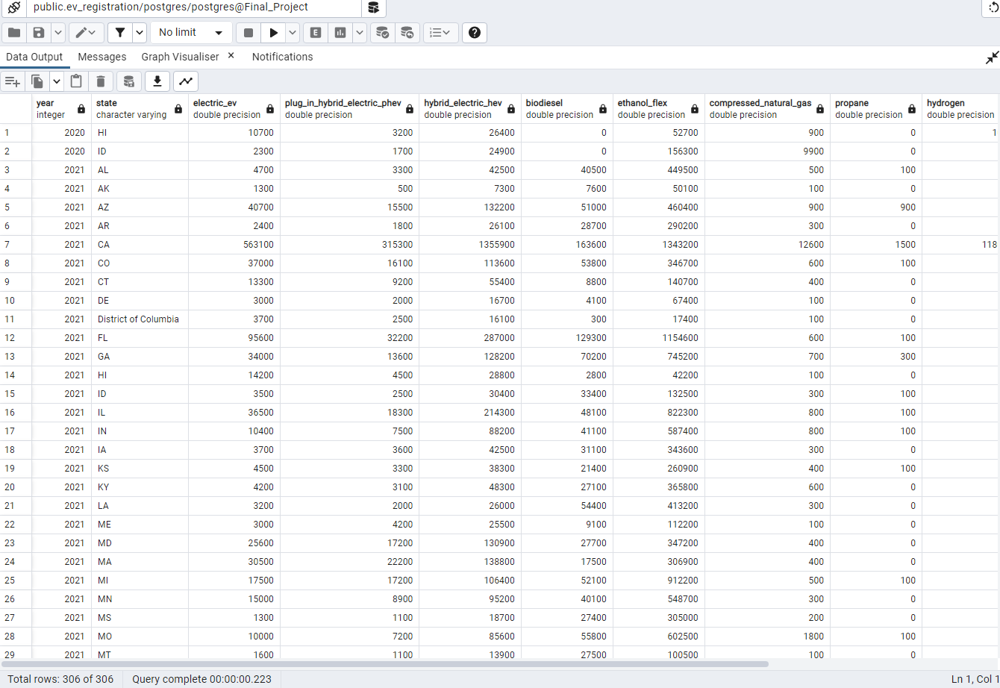
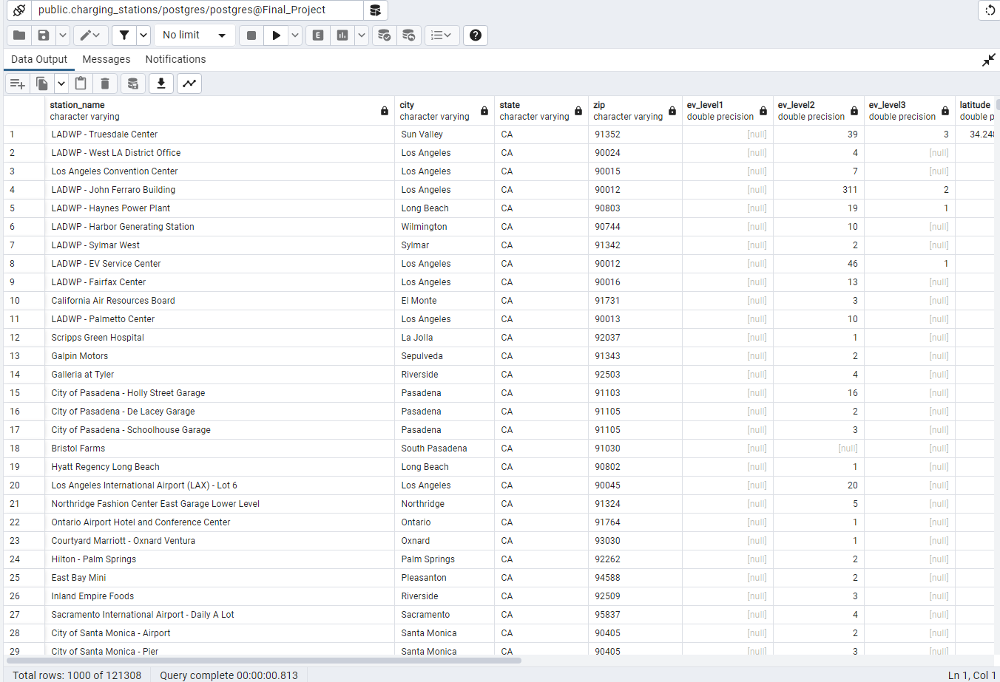

# FinalProject

## Background
- climate policy
- autonomous vehicles
- transportation infrastructure

## Analysis Overview

### Predict EV Population by State
Use a machine learning time series regression model to predict the number of electic vehicles on the road by 20XX. Predictions will be broken down by fuel-type (BEV, PHEV). 

Inputs: 
- Registered EVs by fuel-type by State
- Population
- Median income
- Education bachelor’s degree or higher  

Output:
- Number of electric vehicles by fuel-type by state

#### Data Sources
- Registration Data: https://www.atlasevhub.com/materials/state-ev-registration-data
- US Census Data

### Predict EV Charging Station Population by State
Use a machine learning time series regression model to predict the number of public electric vehicle charging stations by 2030. 

Output: 
- Number of electric vehicle charging stations by state

#### Data Sources
- Registation Data: https://www.atlasevhub.com/materials/state-ev-registration-data 
- Fuel Station Data: https://afdc.energy.gov/data_download

### Estimate Proportion of EVs to Charging Stations
Use the projections found in part 1 and part 2 to calculate the estimated proportion of electric vehicles to charging stations by state. Compare the calculated proportion to the recommended ratio found in the literature. Assign a prepared or not-prepared value to each state based on the proportions. 

## Segment Two 

### Selected Topic

With mounting pressure to address climate change, individuals have increasingly switched to alternative fuel vehicles including battery electric vehicles (BEVs) and plug-in hyprid electric vehicles (PHEV). Electric vehicle infrastructure, including charging stations, must continue to grow to meet the rising demand. We have chosen to evaluate whether charging station infastructure is on pace to accommodate EV adoption nationwide and, more specifically, within the state of Wisconsin. By predicting the proportion of electric vehicles to charging stations into 2030 by state (and county in Wisconsin), we can determine areas that need more resources and infrastructure funding to meet demand. With adequate infastructure in place, we can maximize the benefits of electric vehicles in slowing climate polluation and ensuring a cleaner environment.      

### Description of the Data

The data needed for this project includes: number of electric vehicles registered per state, number of electric vehicles registered per county in Wisconsin, the number of charging stations per state, the number of charging stations per county in Wisconsin, as well as summary data of population, median income, and education (bachelor's degree or higher). We have sourced our data from the US Department of Energy, Atlas EV Hub, and the US Census Bureau. Electric vehicles have only been commercially available for a short time so most of our data only goes back 10 years or so. We plan to use machine learning models to make predictions out to the year 2030.  We will be using a supervised learning linear regression model.  We will predict number of electric cars and charging stations for the US and for Wisconsin.

#### Inputs: 
- Registered EVs by fuel-type by State 2016-2021

- Charging stations within the US

- Population of each state 2016-2021

- Median income of each state 2016-2021

- Education level of each state 2016-2021 (percent bachelor’s degree or higher) 

#### Output:
- Ratio of electric vehicles to charging stations in US and WI
- Predictions on future electric vehicle adoption based on population, income and education

### Questions to Answer

*	How many electric vehicles will there be in 2030 by state (and county in Wisconsin)
* How many charging stations will there be in 2030 by state (and county in Wisconsin) 
* What is the ratio of electric vehicles to charging stations by state (and county in Wisconsin)
* Are there enough charging stations per EV based on the recommended ratio from the literature?
* Are we following the right trend to meet recent governmental initiatives for EV adoption?

### Our Data Story

### A description of the data exploration phase of the project.
Our main objective during the data exploration phase was to gain a deeper understanding of the dataset and uncover any hidden patterns, trends, or anomalies. This process involved several steps:

1. **Initial Dataset Inspection**: We began by scrutinizing the structure and variables in the dataset, evaluating the data types, range of values, and the presence of any missing or irregular data. We identified some inconsistencies in the EV registration data and promptly addressed them.

2. **Correlation Analysis**: To assess the linear relationships between pairs of continuous variables, we performed a correlation analysis. This helped us identify the most relevant variables for our predictive modeling, primarily focusing on the relationship between year and state across our census data and EV registration data.

3. **Visualization**: After importing the data into Tableau, we created line charts and other graphs to visually compare the variables in our dataset.

Created a line chart to visualize vehicle registration trends from 2016-2021 by fuel-type for the United States. From 2020 to 2021, there was a steady increase in electric vehicle registrations.

Mapped the proportion of electric vehicles registrated by state. The West coast (in particular California) is leading the way in EV adoption. 

4. **Feature Engineering**: Informed by our observations during the exploration phase, we pinpointed opportunities to transform existing features to better capture the patterns in the data, ultimately enhancing the quality of our analysis. We concentrated on refining the Tableau dashboard to provide greater clarity in visualization.

### A description of the analysis phase of the project.

### The technologies, languages, tools, and algorithms that the team used throughout the project.
* Python
* Amazon S3
* Postgres
* Tableau
